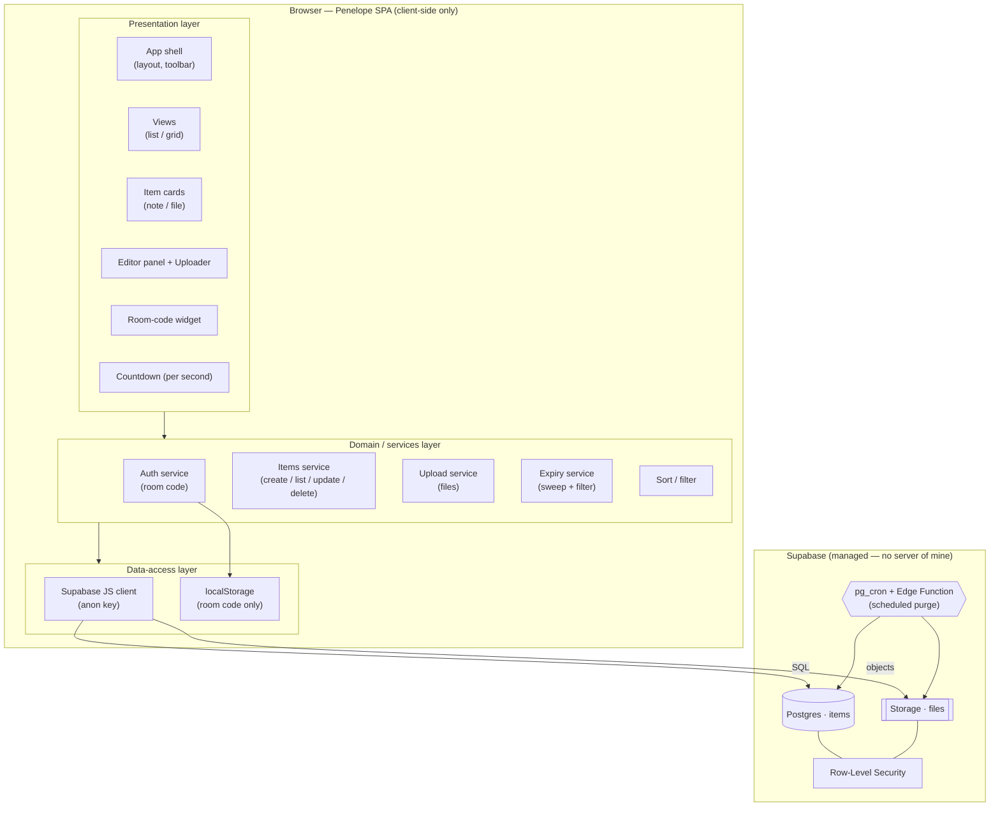
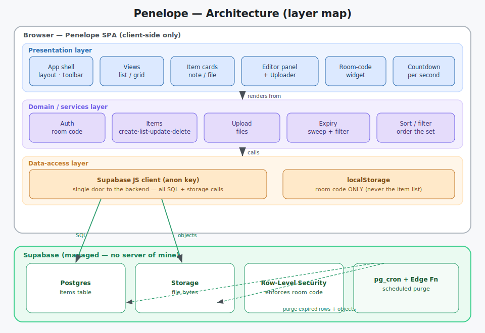

# Architecture

One level inside the [system-context](system-context.md) box: the **internal layers of the SPA** and
the **Supabase resources** they use. This is the map that Layer 1 ([subsystems](../10-subsystems/))
expands into one page per box.

---

## Diagram

---

## The layers

### Presentation layer
Everything the user sees. Renders items into a **list or grid**, shows the **room‑code widget**, the
**editor panel** for notes, the **uploader**, and a **per‑second countdown** on each card. Holds no
truth of its own — it renders what the domain layer gives it. *Design is deferred; this layer is a
placeholder for the visual style supplied later.*

### Domain / services layer
The app's brain, framework‑free plain JS:

| Service | Responsibility |
|---|---|
| **Auth (room code)** | Get/create/edit the 8‑char code; scope every request to it. |
| **Items** | Create notes, list items (live), update a note, delete an item. |
| **Upload** | Push file bytes to Storage, then create the metadata row. |
| **Expiry** | Compute `expires_at`, filter out expired items, run the on‑load sweep. |
| **Sort / filter** | Order and filter the in‑memory item set for the views. |

### Data‑access layer
- **Supabase JS client** — the single door to the backend, using the **public anon key**. All SQL and
  storage calls go through here. This is the app's "API surface" (documented in
  [client-sdk-contracts](../30-data-and-api/client-sdk-contracts.md)).
- **`localStorage`** — stores **only the room code**. Deliberately *not* the source of truth for
  items (a first‑build bug); the item list is always **database‑driven**.

### Supabase (managed backend)
- **Postgres `items`** — one row per note/file ([db-schema](../30-data-and-api/db-schema.md)).
- **Storage** — file bytes, foldered by room code ([storage-layout](../30-data-and-api/storage-layout.md)).
- **Row‑Level Security** — enforces room‑code isolation ([security-rls](../30-data-and-api/security-rls.md)).
- **`pg_cron` + Edge Function** — the scheduled purge ([edge-function-purge](../30-data-and-api/edge-function-purge.md)).

---

## Data‑flow rules (invariants)

1. **UI never touches Supabase directly** — it goes through the domain services.
2. **The item list is always read from the database**, never reconstructed from `localStorage`.
3. **`localStorage` holds the room code and nothing else.**
4. **A file always has two parts** — bytes in Storage **and** a metadata row — created together and
   deleted together.
5. **Every request carries the room code**; RLS rejects anything out of scope.
6. **Expiry is enforced in two independent places** (client filter/sweep **and** scheduled purge) so
   an item is never shown after, and never lingers long past, `expires_at`.

## Mapping to code scaffold

| Layer box | Scaffold stub |
|---|---|
| Supabase client | `src/js/supabase-init.js`, `src/config/supabase-config.example.js` |
| Auth service | `src/js/auth.js` |
| Items service | `src/js/db.js` |
| Upload service | `src/js/storage.js` |
| Presentation | `src/js/ui-render.js`, `src/index.html`, `src/css/styles.css` |
| Countdown | `src/js/countdown.js` |
| Sort / filter | `src/js/sortfilter.js` |
| App wiring | `src/js/main.js` |
| Scheduled purge | `supabase/functions/purge-expired/index.ts`, `supabase/schema.sql`, `supabase/policies.sql` |
