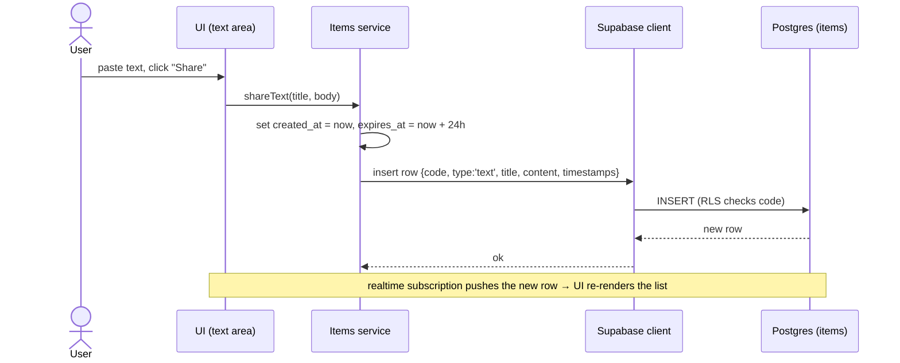
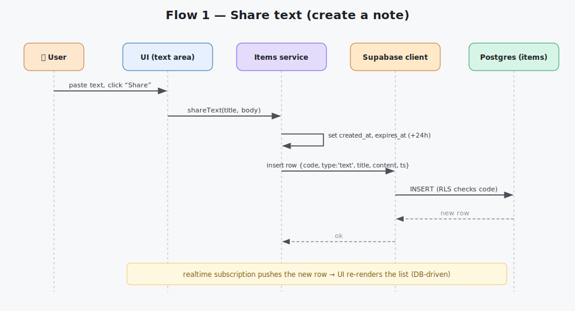
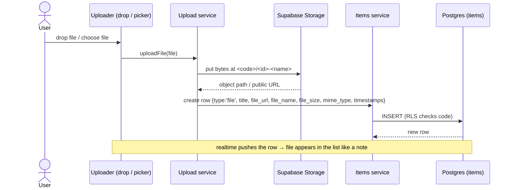
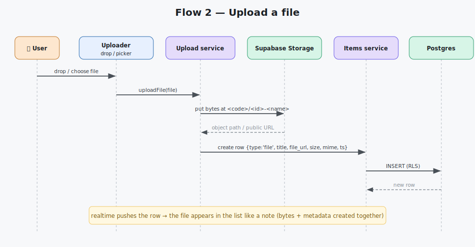
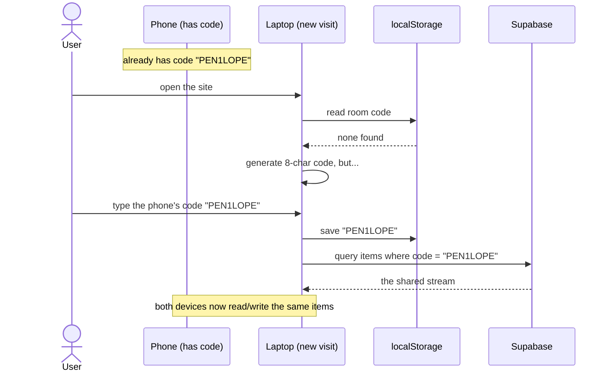
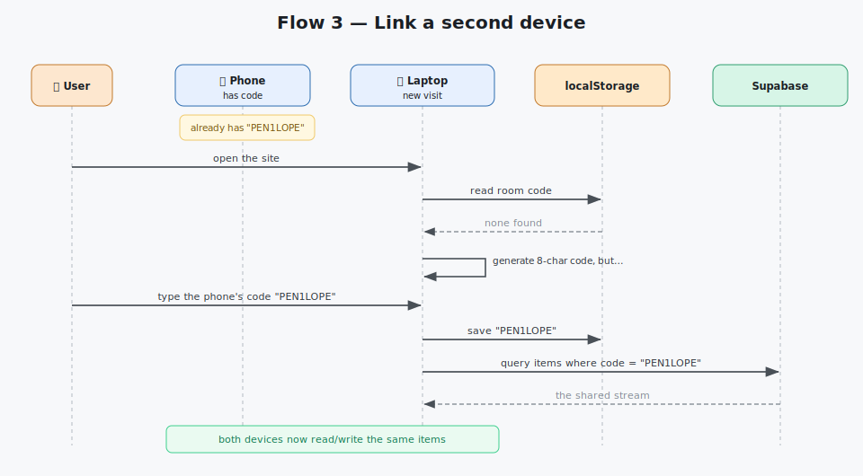
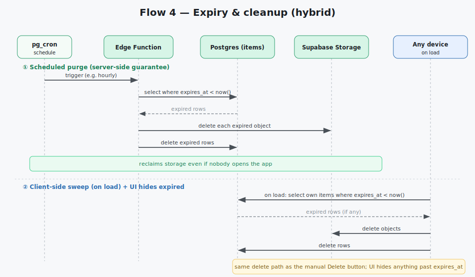

# Primary Flows

The handful of end‑to‑end journeys that define the app. Each is shown top‑to‑bottom as a sequence.
Detailed per‑component behaviour lives in Layer 2 ([components](../20-components/)); the exact call
signatures live in Layer 3 ([client-sdk-contracts](../30-data-and-api/client-sdk-contracts.md)).

The four flows: **share text · upload file · link a device · expiry & cleanup**.

---

## Flow 1 — Share text (create a note)





**Notes:** a note has a **title** shown in the card and a **body** opened in the editor panel — a big
paste never fills the screen. The list re‑renders from the **database**, not local state.

---

## Flow 2 — Upload a file





**Notes:** bytes **and** metadata are created together. Fixing a first‑build bug, **the uploaded file
now appears** in the list immediately, in the same card format (title, size, type).

---

## Flow 3 — Link a second device





**Notes:** linking is just **sharing the same code**. No pairing handshake, no account — the code in
`localStorage` is the only identity, and it's user‑editable.

---

## Flow 4 — Expiry & cleanup (hybrid)

```mermaid
sequenceDiagram
    autonumber
    participant Cron as pg_cron (schedule)
    participant Edge as Edge Function
    participant DB as Postgres (items)
    participant Store as Supabase Storage
    participant UI as Any device on load

    Cron->>Edge: trigger (e.g. hourly)
    Edge->>DB: select items where expires_at < now()
    DB-->>Edge: expired rows
    Edge->>Store: delete each expired object
    Edge->>DB: delete expired rows
    Note over Cron,Store: server-side guarantee — reclaims storage even if nobody visits

    UI->>DB: on load, select own items where expires_at < now()
    DB-->>UI: expired rows (if any)
    UI->>Store: delete objects
    UI->>DB: delete rows
    Note over UI: client-side sweep — instant cleanup; UI also hides anything past expires_at
```



**Notes:** two independent mechanisms. The **scheduled purge** is the real guarantee; the **on‑load
sweep** keeps things instant. Both reuse the same "delete object + delete row" path as the manual
**Delete** button, and the UI always **hides** items past `expires_at` regardless of purge timing.

---

## Flow summary

| # | Flow | Trigger | Touches |
|---|---|---|---|
| 1 | Share text | User clicks Share | Items → DB |
| 2 | Upload file | Drop / pick file | Storage → Items → DB |
| 3 | Link device | Type same code | localStorage → DB |
| 4 | Expiry & cleanup | Schedule + app load | Edge/pg_cron + client sweep → DB + Storage |
