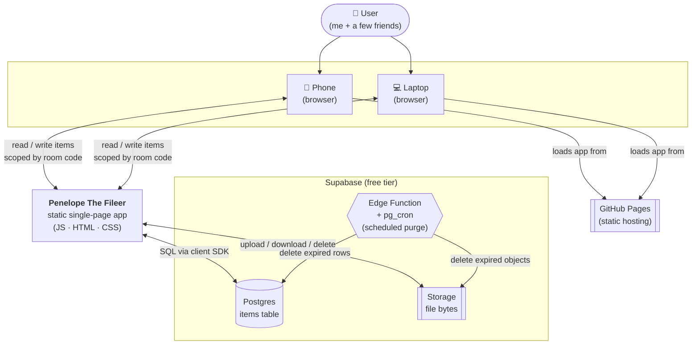
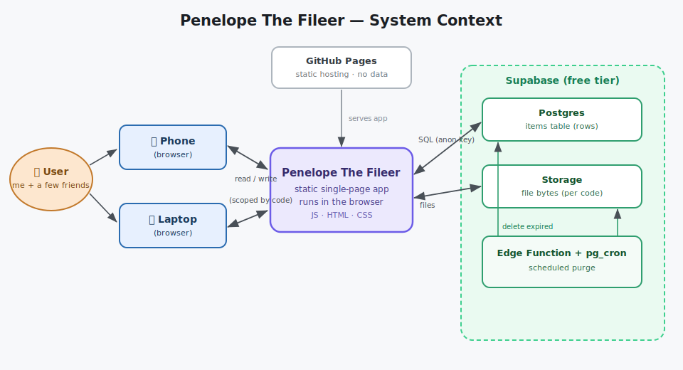

# System Context

The widest view: **Penelope as a single box**, and everything it talks to. No internals yet — just
who uses it and which external services it depends on. (Internals are in
[architecture](architecture.md).)

---

## Diagram

---

## What each actor is

| Actor | Role |
|---|---|
| **User** | Me and a few friends. No accounts — identified only by a room code. |
| **Phone / Laptop browser** | The two (or more) devices being bridged. Each runs the same app. |
| **GitHub Pages** | Serves the static app files. Holds **no data** — just HTML/JS/CSS. |
| **Penelope SPA** | The whole application. Runs entirely in the browser; talks straight to Supabase with the public anon key. |
| **Supabase Postgres** | Stores one **row per item** (notes + file metadata), scoped by room code. |
| **Supabase Storage** | Stores the actual **file bytes**, in a folder named after the room code. |
| **Edge Function + `pg_cron`** | Runs on Supabase's serverless infra (not a server I host). On a schedule it purges expired rows and objects. |

## Key boundaries

- **No backend of my own.** The only "server-side" code is the Supabase Edge Function, which runs on
  Supabase — I never operate a server.
- **The browser talks directly to Supabase** using the **public anon key** (safe to ship in static
  files). The **service-role key** exists only inside the Edge Function's secrets and never reaches
  the browser.
- **Data crosses devices only through Supabase.** Two devices "link" purely by sharing the same room
  code — there is no direct phone‑to‑laptop connection.
- **Isolation is by room code**, enforced by Row‑Level Security (see
  [security-rls](../30-data-and-api/security-rls.md)).

## Trust & data‑sensitivity note

The anon key and room‑code model give **relaxed** isolation — anyone who knows a code can read that
stream. That's an accepted trade‑off for a personal tool. Nothing here is treated as sensitive or
long‑lived (everything self‑deletes in 24 h).
