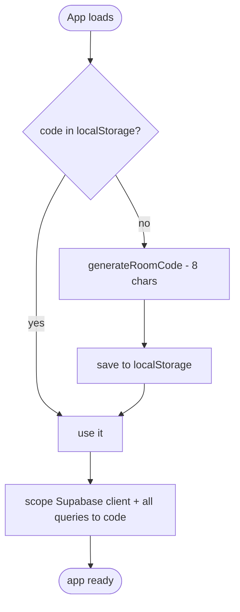
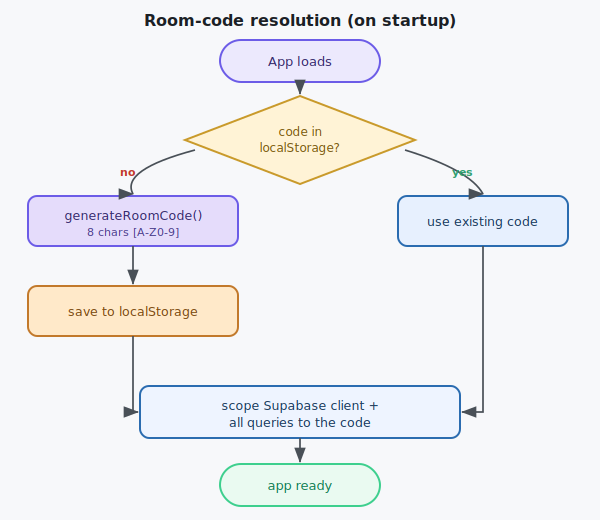

# Subsystem — Auth (Room Code)

The whole identity model. There are **no accounts and no passwords**: a single **8‑character room
code** is the only identity, and it scopes every piece of data. Two devices are "linked" purely by
holding the same code.

> **Security posture (accepted):** the room code is a **bearer secret** — anyone who knows a code can
> read/write that stream. That's fine for me + a few friends. See
> [security-rls](../30-data-and-api/security-rls.md) for exactly what the code does and does not protect.

---

## Responsibilities

1. **Resolve** the current code on startup (load from storage, or generate a new one).
2. **Persist** the code in `localStorage`.
3. **Expose** the code to every other service so all queries are scoped by it.
4. **Let the user view / edit** the code, and re‑scope the app when it changes.

## The code itself (canonical rules)

| Property | Decision |
|---|---|
| Length | **exactly 8 characters** |
| Alphabet | `A–Z` and `0–9` (uppercase alphanumeric) |
| Case | always **uppercased**; input is upper‑cased before use |
| Generation | cryptographically random (`crypto.getRandomValues`), 8 chars from the alphabet |
| Storage key | `localStorage["penelope.roomCode"]` |
| Editable | yes — user may type any valid 8‑char code (e.g. to match another device) |
| Validation | must match `^[A-Z0-9]{8}$` after upper‑casing; reject otherwise |

> **Why 8?** Long enough to at least spell *Penelope*, short enough to type on a phone. Example
> code: `PEN1LOPE`.

## Resolution flow (on startup)

## Editing / linking a device

- The [room-code widget](../20-components/room-code-widget.md) shows the current code and lets the
  user **copy** it or **type a new one**.
- On a valid change: persist the new code, **re‑scope the Supabase client** (the code travels as a
  request header — see [security-rls](../30-data-and-api/security-rls.md)), tear down the old realtime
  subscription, and **reload the item list** for the new code.
- **Linking** a second device = typing the first device's code. No handshake, no pairing screen.

## Boundaries & invariants

- Auth stores **only the code** in `localStorage` — never items (those are always DB‑driven).
- Every outbound request carries the code; nothing is queried "globally".
- Changing the code is equivalent to switching to a different, isolated stream.

## Maps to code

- `src/js/auth.js` — `getRoomCode()`, `setRoomCode(code)`, `generateRoomCode()`.
- Consumed by `src/js/supabase-init.js` (sets the code header) and every service.
- Contracts: [client-sdk-contracts](../30-data-and-api/client-sdk-contracts.md#auth).

## Edge cases

| Case | Behaviour |
|---|---|
| `localStorage` blocked/unavailable | Fall back to an in‑memory code for the session; warn the user it won't persist. |
| User enters lowercase / spaces | Trim + uppercase; then validate. |
| User enters invalid length/chars | Reject with an inline message; keep the old code. |
| Code changed mid‑session | Re‑scope client, resubscribe, reload list (see above). |
