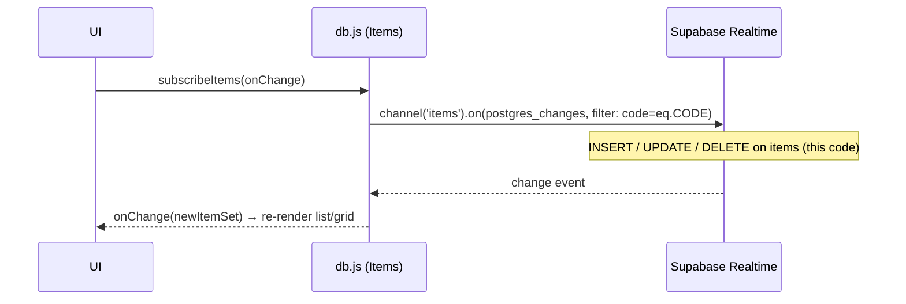
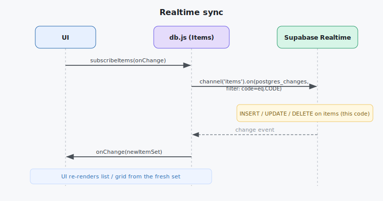

# Subsystem — Data Layer (Supabase Postgres)

Owns every read and write of **item rows** (both text notes and file metadata). This is the app's
source of truth for "what exists" — the UI is **always** rendered from here, never from
`localStorage`.

Implemented in `src/js/db.js` (the **Items service**). Exact signatures:
[client-sdk-contracts](../30-data-and-api/client-sdk-contracts.md). Table shape:
[db-schema](../30-data-and-api/db-schema.md).

---

## Responsibilities

| Operation | What it does |
|---|---|
| **Create note** | Insert a `type:'text'` row (title + content, timestamps). |
| **Create file item** | Insert a `type:'file'` row after `storage.js` uploads the bytes. |
| **List** | Fetch current (non‑expired) items for the room code, newest first. |
| **Subscribe (realtime)** | Live‑update the UI on insert/update/delete for this code. |
| **Update note** | Edit a note's `title` / `content`. |
| **Delete** | Remove a row (and, for files, its stored object via `storage.js`). |

## Canonical query rules

- **Always scoped by code.** Every query filters `code = <room code>` (belt‑and‑braces with the
  header‑based RLS in [security-rls](../30-data-and-api/security-rls.md)).
- **Default ordering:** `created_at desc` (newest first). Sorting/filtering for the views happens
  client‑side in `sortfilter.js` over the fetched set.
- **Expired items are excluded** at read time: `expires_at > now()`. Physical deletion is handled by
  the [expiration subsystem](expiration-and-cleanup.md).
- **No pagination** in v1 (personal scale, 24 h of items). Add later if needed.

## Realtime sync

- One channel per active room code; it is torn down and recreated when the code changes.
- On any change event, the service re‑derives the current item set and hands it to the UI. Simpler
  than patching the DOM per‑event and perfectly fine at this scale.

## Boundaries & invariants

- `db.js` is the **only** module that queries the `items` table.
- It **never** touches file bytes directly — it calls `storage.js` for that, but it **owns** the
  metadata row.
- A **file item is two things** (row + object); deletes go through the shared "delete object + delete
  row" path (also used by expiry). See [storage-layer](storage-layer.md).

## Maps to code

- `src/js/db.js` → `shareText`, `createFileItem`, `listItems`, `subscribeItems`, `updateNote`,
  `deleteItem`.
- Uses the shared client from `src/js/supabase-init.js`.
