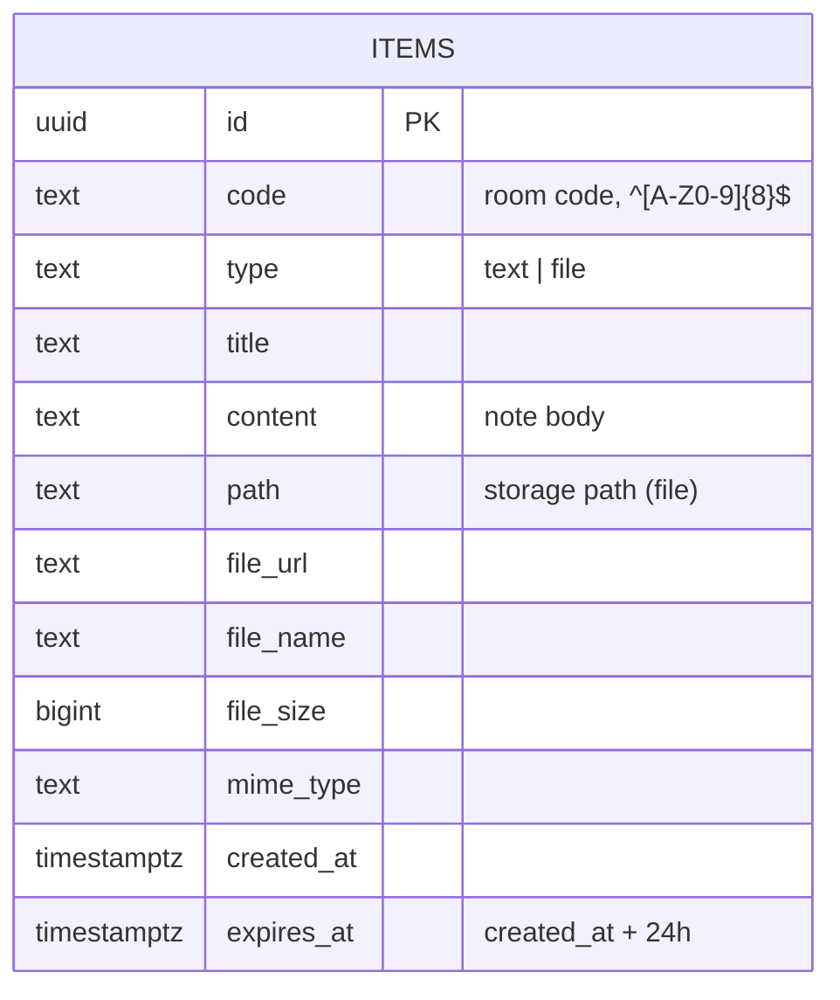
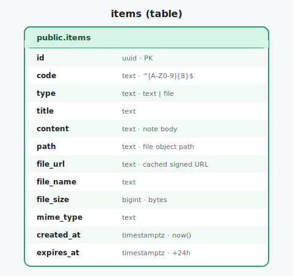

# Data — Database Schema

The single source of truth for the Postgres side. Everything is one table: **`items`** (both notes and
file metadata). This is code‑ready DDL — a fresh session can run it verbatim.

---

## The `items` table

```sql
-- Requires pgcrypto for gen_random_uuid() (enabled by default on Supabase).
create table public.items (
  id          uuid        primary key default gen_random_uuid(),
  code        text        not null check (code ~ '^[A-Z0-9]{8}$'),   -- room code (scopes the row)
  type        text        not null check (type in ('text','file')),

  title       text        not null default '',                       -- shown on the card

  -- text notes:
  content     text,                                                  -- note body (type = 'text')

  -- file items:
  path        text,                                                  -- storage object path <code>/<id>-<name>
  file_url    text,                                                  -- optional cached signed URL (24h)
  file_name   text,
  file_size   bigint,                                                -- bytes
  mime_type   text,

  created_at  timestamptz not null default now(),
  expires_at  timestamptz not null default (now() + interval '24 hours'),

  -- shape guarantees per type:
  constraint items_text_shape check (type <> 'text' or content is not null),
  constraint items_file_shape check (type <> 'file' or (path is not null and file_name is not null))
);

create index items_code_idx          on public.items (code);
create index items_expires_idx       on public.items (expires_at);
create index items_code_created_idx  on public.items (code, created_at desc);
```

## Column reference

| Column | Type | Notes |
|---|---|---|
| `id` | `uuid` | PK, server‑generated. Also used in the storage path. |
| `code` | `text` | The 8‑char room code. `CHECK ^[A-Z0-9]{8}$`. Indexed. |
| `type` | `text` | `'text'` or `'file'`. |
| `title` | `text` | Card title. Notes: user title or first line; files: `file_name`. |
| `content` | `text` | Note body. Required when `type='text'`. |
| `path` | `text` | Storage object path. Required when `type='file'`. |
| `file_url` | `text` | Optional cached signed URL (regenerated on download). |
| `file_name` | `text` | Original file name. Required when `type='file'`. |
| `file_size` | `bigint` | Size in bytes. |
| `mime_type` | `text` | For icon/label; not restricted. |
| `created_at` | `timestamptz` | `default now()`. |
| `expires_at` | `timestamptz` | **`default now() + interval '24 hours'`** — the 24 h lifetime, enforced by the DB so it can't be forgotten. |

## Enable realtime

```sql
-- Let the client subscribe to changes on this table.
alter publication supabase_realtime add table public.items;
```

## Row shapes (examples)

**Text note**
```json
{ "id":"…","code":"PEN1LOPE","type":"text","title":"wifi password",
  "content":"guest-network / hunter2",
  "created_at":"2026-07-16T10:00:00Z","expires_at":"2026-07-17T10:00:00Z" }
```

**File item**
```json
{ "id":"…","code":"PEN1LOPE","type":"file","title":"report.pdf",
  "path":"PEN1LOPE/…-report.pdf","file_name":"report.pdf",
  "file_size":184320,"mime_type":"application/pdf",
  "created_at":"2026-07-16T10:05:00Z","expires_at":"2026-07-17T10:05:00Z" }
```

## Diagram





## Query patterns (used by `db.js`)

| Purpose | Query |
|---|---|
| List current | `select * from items where code=$1 and expires_at > now() order by created_at desc` |
| Insert note | `insert into items (code,type,title,content) values (…)` |
| Insert file | `insert into items (code,type,title,path,file_name,file_size,mime_type) values (…)` |
| Update note | `update items set title=$2, content=$3 where id=$1` |
| Delete | `delete from items where id=$1` |
| Expired (sweep/purge) | `select id, path from items where expires_at <= now()` |

> `code` is also carried as a request header so **RLS** confines every query to one code — see
> [security-rls](security-rls.md).
