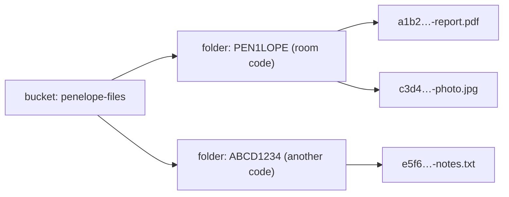
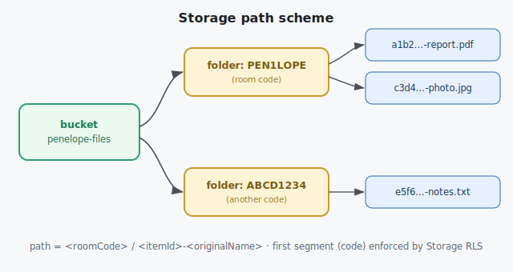

# Data — Storage Layout

How file bytes are organised in Supabase Storage.

---

## Bucket

| Property | Value |
|---|---|
| Bucket name | `penelope-files` |
| Visibility | **private** (not public) |
| Access | via **signed URLs**, TTL **24 h** (matches item lifetime) |
| Per‑file size cap | **25 MB** (client‑enforced before upload; also set on the bucket) |

```sql
-- create the private bucket (or via the Supabase dashboard)
insert into storage.buckets (id, name, public, file_size_limit)
values ('penelope-files','penelope-files', false, 26214400)   -- 25 MiB
on conflict (id) do nothing;
```

## Object path scheme

```
penelope-files/<roomCode>/<itemId>-<originalName>
                └─ folder ─┘└──── object key ─────┘
```

- The **first folder segment is the room code** — this is what Storage RLS checks
  ([security-rls](security-rls.md#storage-policies)).
- `<itemId>` is the item's `uuid` (guarantees uniqueness even for identical file names).
- `<originalName>` is sanitised (strip path separators; keep extension).





## Lifecycle

- **No** Supabase‑native lifecycle rule (free tier). Expired objects are removed by the **scheduled
  purge** ([edge-function-purge](edge-function-purge.md)) and the **client sweep**, using the `path`
  stored on each file row.
- Deleting an item always removes the object **and** the row together
  ([storage-layer](../10-subsystems/storage-layer.md)).

## Trade‑off note (private vs public bucket)

A **public** bucket would let cards use a permanent URL (simpler) but any guessed path is world‑
readable. We choose **private + signed URLs** because the 24 h TTL aligns perfectly with the item
lifetime and keeps files from being trivially enumerable. If simplicity is ever preferred over this,
switch `public=true` and store a permanent `file_url`; nothing else in the schema changes.
