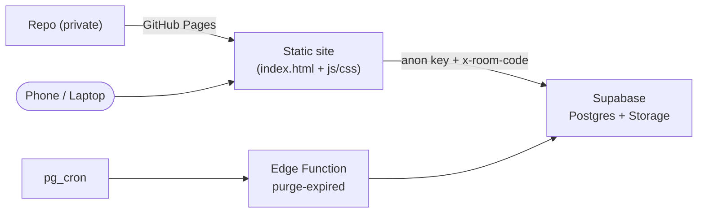
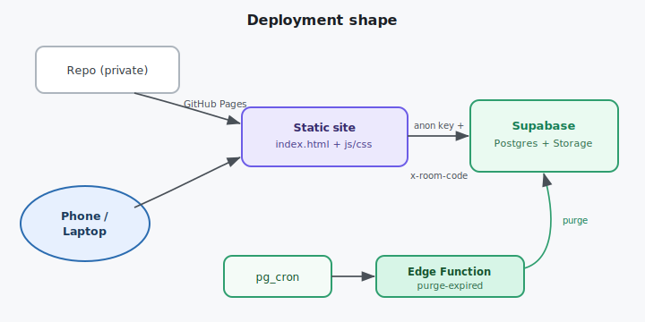

# Cross-cutting — Deployment

End‑to‑end setup: stand up Supabase, then publish the static site to GitHub Pages. No server of your
own runs anywhere.

---

## A. Supabase (one time)

1. **Create a project** at supabase.com; note the **Project URL**, **anon key**, and **service‑role
   key**.
2. **Schema:** run `supabase/schema.sql` (SQL editor) — creates `items`, indexes, realtime publication
   ([db-schema](../30-data-and-api/db-schema.md)).
3. **Bucket:** create the private `penelope-files` bucket (SQL snippet in
   [storage-layout](../30-data-and-api/storage-layout.md)).
4. **RLS:** run `supabase/policies.sql` — the `request_room_code()` helper, table policies, storage
   policies ([security-rls](../30-data-and-api/security-rls.md)).
5. **Purge function:** `supabase functions deploy purge-expired --no-verify-jwt`, then
   `supabase secrets set PURGE_SECRET=<random>`.
6. **Schedule:** run the `cron.schedule(...)` SQL ([edge-function-purge](../30-data-and-api/edge-function-purge.md)).

## B. Frontend config

- Copy `src/config/supabase-config.example.js` → `supabase-config.js`, fill in URL + anon key +
  bucket ([config-and-env](config-and-env.md)).

## C. Publish to GitHub Pages

The app is static (`src/` = `index.html`, `css/`, `js/`, `config/`). Options:

- **Simple:** set Pages to serve from the `src/` folder (or move `src/` contents to repo root / `docs/`
  Pages folder). No build step — plain JS/HTML/CSS + Supabase from CDN or bundled.
- **Base path:** GitHub Pages serves at `/<repo>/`; use **relative** asset paths (already the case in
  `index.html`) so it works under a sub‑path.
- The Supabase JS client loads either from a CDN `<script type="module">` import or a small bundler —
  document whichever the build session picks; the contracts don't change.

## Deployment shape

## Checklist

- [ ] Schema + indexes + realtime applied
- [ ] Private bucket created
- [ ] RLS helper + table + storage policies applied
- [ ] Purge function deployed + `PURGE_SECRET` set
- [ ] `pg_cron` job scheduled
- [ ] `supabase-config.js` filled in (anon key only)
- [ ] Pages serving `src/`
