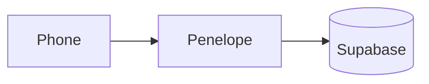

# Documentation Conventions

This file defines **how** the Penelope documentation is written and organised. It is the rulebook
every other doc follows so the set stays consistent as it grows layer by layer. Read this once; then
the rest of the docs behave predictably.

> **Audience:** the docs serve **two readers at once** — a **human** (readable prose + a rendered
> image for every diagram) and **Claude Code / an AI builder** (precise schemas, contracts, and a
> file tree it can implement from). Every page should satisfy both.

---

## 1. Layered structure (top‑down)

Documentation is organised into numbered layers, from the widest view down to the deepest detail.
You should be able to start at Layer 0 and drill down without ever needing outside context.

| Folder | Layer | Answers the question |
|---|---|---|
| `00-overview/` | 0 — Overview | *What is Penelope, and how does it fit together at a glance?* |
| `10-subsystems/` | 1 — Subsystems | *What are the major moving parts, and what is each responsible for?* |
| `20-components/` | 2 — Components | *What is each individual piece (UI + logic), in detail?* |
| `30-data-and-api/` | 3 — Data & API | *What are the exact schemas, storage layout, security rules, and client/server contracts?* |
| `40-cross-cutting/` | 4 — Cross‑cutting | *Concerns that span all layers: config, deployment, errors, state.* |

Higher numbers = deeper detail. A reader picks the layer that matches how much detail they need.

---

## 2. Every document has front‑matter

Each `.md` file starts with a YAML front‑matter block:

```yaml
---
layer: 0            # 0–4, or "meta"
status: 🟡 draft    # see status legend below
related:            # relative links to closely-related docs
  - "[architecture](architecture.md)"
---
```

**Status legend** (also used in the doc‑map tracker):

| Symbol | Meaning |
|---|---|
| ⚪ not-started | Placeholder exists, no real content yet |
| 🟡 draft | Content written, not yet reviewed/confirmed by the user |
| 🟢 done | Reviewed and confirmed |

---

## 3. Diagrams: code **and** image, always a pair

Per the project requirement, **every diagram is stored twice**:

1. **`<name>.mmd`** — the [Mermaid](https://mermaid.js.org/) source (diagram *as code*; editable,
   diff‑able, re‑renderable).
2. **`<name>.svg`** — a rendered image (so a human sees the picture in any plain viewer).

Both live in the layer's `diagrams/` sub‑folder. The `.md` page that uses the diagram embeds **both**:

````markdown



````

- The ```` ```mermaid ```` fenced block renders automatically in GitHub, Obsidian, and VS Code
  (with a Mermaid extension) — that is the "code that shows up".
- The `` is the "photo for a human" — visible even in a dumb text/markdown viewer.
- **Keep the two in sync:** if you edit the `.mmd`, re‑export (or re‑author) the `.svg`.

### How SVGs are produced

The intended tool is `npx @mermaid-js/mermaid-cli` (`.mmd → .svg`). In the current build
environment its headless Chromium **cannot launch**, so Layer 0 SVGs are **hand‑authored** to match
their `.mmd` source (same nodes, same arrows, clean neutral styling). If a machine where
`mermaid-cli` runs becomes available, SVGs can be regenerated from the `.mmd` files unchanged.

**SVG style rules** (so images read well in both light and dark viewers):

- Always paint an explicit background rectangle (light `#f7f8fa`) — never rely on the page theme.
- Dark text (`#1b1f24`), medium borders, a small accent palette (Penelope, phone/laptop, Supabase).
- `viewBox` set, `width`/`height` omitted or relative so the image scales inside the page.

---

## 4. File & naming conventions

- Folders are numbered (`00-`, `10-`, …) so they sort in reading order.
- Doc and diagram file names are `kebab-case`.
- A diagram and the doc that owns it share a name where practical
  (`architecture.md` ↔ `diagrams/architecture.svg`).
- Cross‑link between docs with **relative** markdown links so the tree is portable.

---

## 5. Code scaffold mirrors the docs

Alongside `docs/` the repo carries an **empty code scaffold** (`src/`, `supabase/`). During this
documentation phase those files contain **header comments only** — a description of the file's role
and the contract it will implement — **no working logic**. As each doc layer is completed, the
matching stub's header comment is filled in. This keeps "what we said" and "where it will live"
pointing at each other.

> Out of scope during documentation: real application logic, the visual/UI design (deferred — the
> user will supply it), and real Supabase credentials.

---

## 6. Working rhythm

We build **one layer at a time** and **pause for review** after each. When a layer is confirmed, its
docs move to 🟢 in the [doc‑map](doc-map.md), and we drill into the next layer down.
